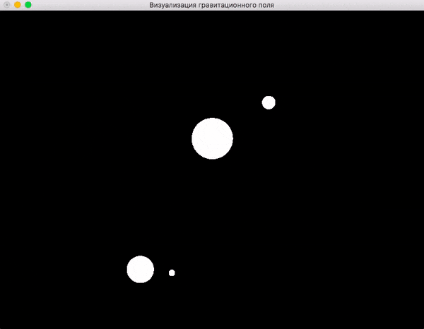

# demo-force-field

Визуализация векторного поля.



## Сборка и запуск

Клонируйте репозиторий:

```
git clone https://github.com/cmc-haskell-2017/demo-force-field.git
cd demo-force-field
```

Соберите проект при помощи [утилиты Stack](https://www.haskellstack.org):

```
stack setup
stack build
```

Собрать проект и запустить игру можно при помощи команды

```
stack build && stack exec demo-force-field
```

## Задание

В качестве задания к [лекции «Моноиды»](https://youtu.be/C0uRL-CMk1Q) требуется
реализовать экземпляр класса типов `Monoid` для [типа `Bounds`](https://github.com/cmc-haskell-2017/demo-force-field/blob/master/src/ForceField.hs#L54-L57) и [функцию `bounds`](https://github.com/cmc-haskell-2017/demo-force-field/blob/master/src/ForceField.hs#L59-L61).

Как только вы реализуете эту функцию, область моделирования будет автоматически масштабироваться, чтобы захватывать все объекты.
